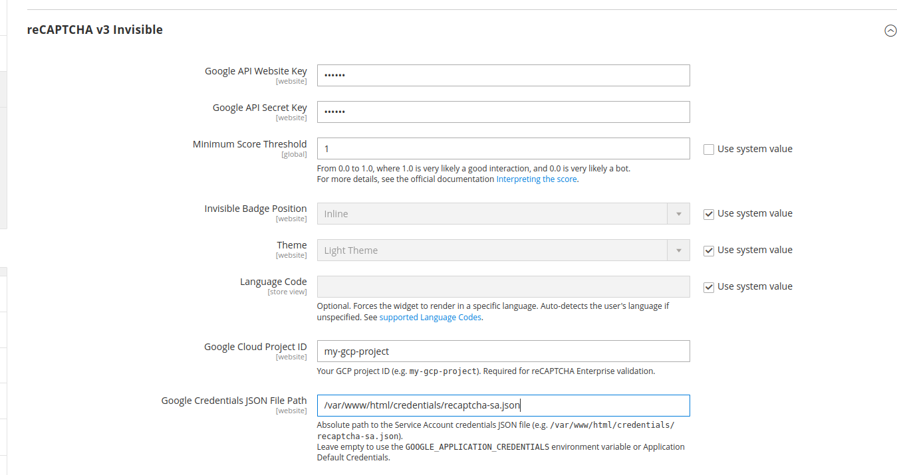

# Lohoy ReCaptchaEnterprise

This module extends the Magento native ReCaptcha UI functionality to integrate Google ReCaptcha Enterprise instead of the default implementation. It leverages the [official Google Cloud PHP Client for reCAPTCHA Enterprise](https://cloud.google.com/php/docs/reference/cloud-recaptcha-enterprise/latest) under the hood.

## Requirements

* PHP >= 8.1
* Magento ReCaptchaEnterprise module

## Installation

1. Add the module to your project via Composer:
   ```bash
   composer require lohoy/magento-recaptcha-enterprise
   ```

2. Enable the module:
   ```bash
   bin/magento module:enable Lohoy_ReCaptchaEnterprise
   bin/magento setup:upgrade
   ```

## Configuration

To configure the module from the Magento Admin:

1. Navigate to **Stores > Configuration > Security > Google reCAPTCHA Storefront**.
2. Expand the **reCAPTCHA v3 Invisible** section.
3. Provide the credentials specific to your Google Cloud Enterprise project:
   * **Google Cloud Project ID**: Your Google Cloud project ID.
   * **Google Credentials JSON File Path**: Absolute path to the Service Account credentials JSON file (e.g., `/var/www/html/magento/credentials.json`). Leave empty to use the `GOOGLE_APPLICATION_CREDENTIALS` environment variable or Application Default Credentials.


